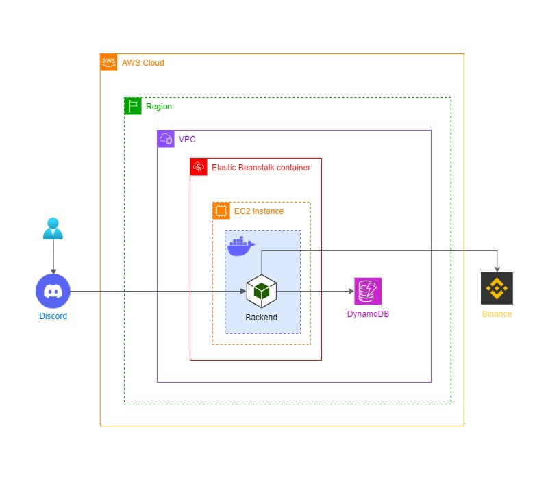

# DISCORD MONITOR BOT

> ### **OVERVIEW**

Discord Bot designed to monitor cryptocurrencies. The bot utilizes various libraries and services to provide real-time price quotes, send notifications, and operate efficiently and scalably on AWS infrastructure.

> [!NOTE]
> This project showcases the integration of various technologies to create a robust and efficient Discord bot for monitoring cryptocurrencies. As an open-source project, it welcomes contributions and feedback from the community to continually improve and enhance its features.

---

> ### **ARCHITECTURE**

---

> ### **FUNCTIONALITIES**

**Cryptocurrency Monitoring**

The bot utilizes the binance-api-node library to obtain real-time price quotes for specific currency pairs on Binance. Users can request the current price of any supported cryptocurrency pair on Binance through commands in Discord.

**Discord Interaction**

The bot uses the _discord.js_ library to create and manage its presence on Discord. It can receive and respond to user messages, executing commands to provide cryptocurrency price information.

> [!IMPORTANT]
> It's essential to implement rate limiting mechanisms to prevent abuse and ensure the bot's stability and performance.

**Webhook Notifications**

Using the axios library, the bot can send notifications to a specific Discord channel via webhooks. Notifications can be configured to be sent at regular intervals or when certain price criteria are met.

**Task Scheduling**

The bot uses the cron library to schedule price checks and send notifications at specific times. It can be configured to send a daily summary of cryptocurrency prices at certain time.

---

> ### **INFRASTRUCTURE**

**Docker**

The entire bot application is packaged in a Docker container, ensuring consistency and ease of deployment. Using Docker allows the bot to run in any environment that supports containers, providing flexibility and portability.

> [!TIP]
> Consider deploying your Docker image to Amazon Elastic Container Registry for enhanced management and security. ECR provides a secure and scalable repository for your Docker images, facilitating version control, access management, and integration with AWS services like ECS for container orchestration.

**Amazon Web Services**

The bot is deployed on AWS to ensure high availability and scalability. The Dockerized application is deployed on an EC2 instance managed by Elastic Beanstalk. For monitoring and analysis, user interaction logs with the bot are stored in DynamoDB, a fully managed NoSQL database service that offers fast and predictable performance with automatic scaling.

> [!WARNING]
> It is imperative for users to deploy their own application on AWS using their own credentials to ensure compliance and security. This ensures that users have full control over their application's environment and data, facilitating customization and enhancing security measures.

---

> ### **AUTHORS**

[Giovane Iwamoto](https://github.com/GiovaneIwamoto) | [Rafael Oshiro](https://github.com/Reshzera) | [Matheus Tavares](https://github.com/mtguerson)

We are always open to receiving constructive criticism and suggestions for improving our developed code. We believe that feedback is essential for learning and growth, and we are eager to learn from others to make our code the best it can be. Whether it's a minor tweak or a major overhaul, we are willing to consider all suggestions and implement changes that will benefit our code and its users.
