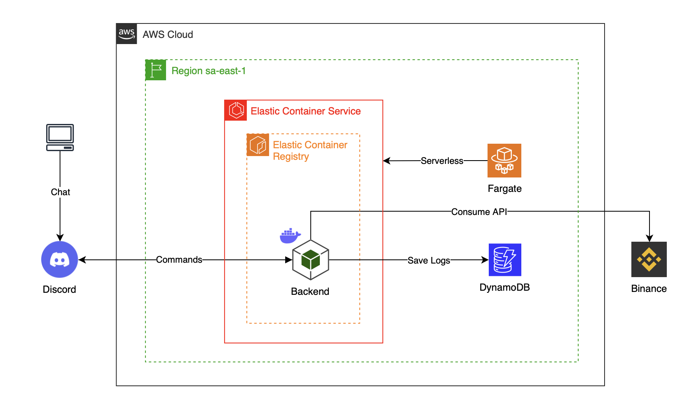
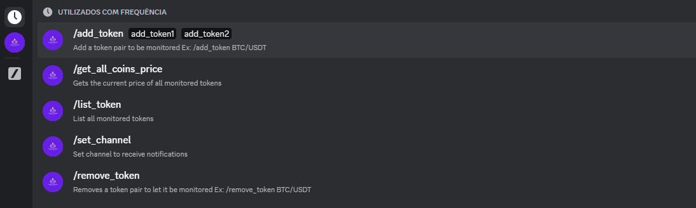

# DISCORD MONITOR BOT

### **OVERVIEW**

Discord Bot designed to monitor cryptocurrencies. The bot utilizes various libraries and services to provide real-time price quotes, send notifications, and operate efficiently and scalably on AWS infrastructure.

[](https://skillicons.dev)


> [!NOTE]
> This project showcases the integration of various technologies to create a robust and efficient Discord bot for monitoring cryptocurrencies. As an open-source project, it welcomes contributions and feedback from the community to continually improve and enhance its features.

---

### **ARCHITECTURE**



---

### **FUNCTIONALITIES**

- **Cryptocurrency Monitoring**

  The bot utilizes the binance-api-node library to obtain real-time price quotes for specific currency pairs on Binance. Users can request the current price of any supported cryptocurrency pair on Binance through commands in Discord.

- **Discord Interaction**

  The bot uses the _discord.js_ library to create and manage its presence on Discord. It can receive and respond to user messages, executing commands to provide cryptocurrency price information.

https://github.com/GiovaneIwamoto/discord-monitor-bot/assets/81972850/698b01c1-16f9-470a-b241-ddae4864fc85

> [!IMPORTANT]
> It's essential to implement rate limiting mechanisms to prevent abuse and ensure the bot's stability and performance.



- **Webhook Notifications**

  Bot send notifications to a specific Discord channel via webhooks. Notifications can be configured to be sent at regular intervals or when certain price criteria are met.

- **Task Scheduling**

  The bot uses the cron library to schedule price checks and send notifications at specific times. It can be configured to send a daily summary of cryptocurrency prices at certain time.

---

### **INFRASTRUCTURE**

- **Docker**

  The entire bot application is packaged in a Docker container, ensuring consistency and ease of deployment. Using Docker allows the bot to run in any environment that supports containers, providing flexibility and portability.

> [!TIP]
> Consider deploying your Docker image to Amazon Elastic Container Registry for enhanced management and security. ECR provides a secure and scalable repository for your Docker images, facilitating version control, access management, and integration with AWS services like ECS for container orchestration.

- **Amazon Web Services**

  AWS Elastic Container Registry (ECR) is utilized in this project to facilitate the deployment of Docker containers. ECR provides a secure and scalable repository for storing Docker images, allowing seamless integration with other AWS services such as AWS Elastic Container Service (ECS). AWS ECS manages the orchestration and deployment of Dockerized applications. Leveraging ECS, particularly with AWS Fargate, enables efficient and cost-effective deployment by abstracting away the underlying infrastructure management. ECS utilizes tasks to define the application’s container configurations and scheduling requirements, while clusters group together container instances to scale and manage workload distribution effectively.

  AWS CloudWatch plays a critical role in this ecosystem by providing centralized logging and monitoring for ECS deployments. CloudWatch enables real-time insights into application and infrastructure performance, facilitating proactive management through customizable metrics, alarms, and logs analysis. Monitoring ECS tasks and clusters via CloudWatch ensures operational visibility and helps maintain optimal performance and availability of deployed applications.

> [!WARNING]
> It is imperative for users to deploy their own application on AWS using their own credentials to ensure compliance and security. This ensures that users have full control over their application's environment and data, facilitating customization and enhancing security measures.

https://github.com/GiovaneIwamoto/discord-monitor-bot/assets/81972850/f299bedc-1005-4e5d-9ff8-d14c12544626

> [!IMPORTANT]
> To enable access to DynamoDB, the user must configure the ecsTaskExecutionRole by attaching the AmazonDynamoDBFullAccess permission policy. This grants the necessary permissions for the ECS tasks to interact with DynamoDB resources, ensuring seamless data management and operations within the application.

---

### **INSTALLATION GUIDE**

- Configure your AWS credentials managed by IAM:

```javascript
$ aws configure
AWS Access Key ID [None]: ACCESSKEYEXAMPLE
AWS Secret Access Key [None]: SECRETKEYEXAMPLE
Default region name [None]: sa-east-1
Default output format [None]: ENTER
```

> [!CAUTION]
> Credentials should remain local to your environment only. Never expose your credentials in any part of the code, such as in source files, comments, or commit history. Instead, use environment variables or secure secret management tools to manage and access your credentials securely.

- Set up environment variables:

```ruby
APPLICATION_ID=your-application-id
DISCORD_BOT_TOKEN=your-bot-token
```

- Discord Privileged Gateway Intents:

  Some Gateway Intents require approval if your bot is verified. If your bot is not verified, you can toggle these intents to access them: `PRESENCE INTENT | SERVER MEMBERS INTENT | MESSAGE CONTENT INTENT`

- Discord OAuth2 Permissions:

  Generate an invite link for your application by picking the scopes and permissions it needs to function. Under `OAuth2 URL Generator` at **Scopes** mark the checkbox for **Bot** and set **Administrator** permission or choose the specific permissions your bot needs.

https://github.com/GiovaneIwamoto/discord-monitor-bot/assets/81972850/7cd23a40-76eb-4f45-8191-ffb31feb6654

> [!IMPORTANT]
> When deploying applications using AWS Elastic Container Service (ECS) that require access to services sensitive to geographic restrictions, such as the Binance API which is restricted in some countries like the United States, it is crucial to select the São Paulo (sa-east-1) region. This region ensures compliance with regional data sovereignty and access restrictions, facilitating seamless integration and operation of applications dependent on such external services.

- Deploy Docker image to ECR

```ruby
aws ecr get-login-password --region sa-east-1 | docker login --username AWS --password-stdin <aws_id>.dkr.ecr.sa-east-1.amazonaws.com
docker build -t <image_name> .
docker tag <image_name>:latest <aws_id>.dkr.ecr.sa-east-1.amazonaws.com/<image_name>:latest
docker push <aws_id>.dkr.ecr.sa-east-1.amazonaws.com/<image_name>:latest
```

- Local development:

```shell
npm install | npm run build | npm run start
docker-compose build | docker-compose up
```

> [!TIP]
> Discord Developer Portal: https://discord.com/developers/docs/intro

---

### **AUTHORS**

[Giovane Iwamoto](https://github.com/GiovaneIwamoto) | [Rafael Oshiro](https://github.com/Reshzera) | [Matheus Tavares](https://github.com/mtguerson) | [Alexandre Diniz](https://github.com/alexandredsz)

We are always open to receiving constructive criticism and suggestions for improving our developed code. We believe that feedback is essential for learning and growth, and we are eager to learn from others to make our code the best it can be. Whether it's a minor tweak or a major overhaul, we are willing to consider all suggestions and implement changes that will benefit our code and its users.
